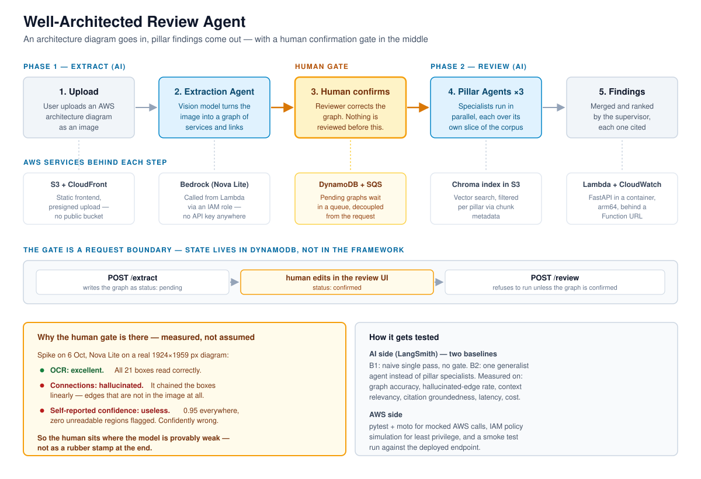
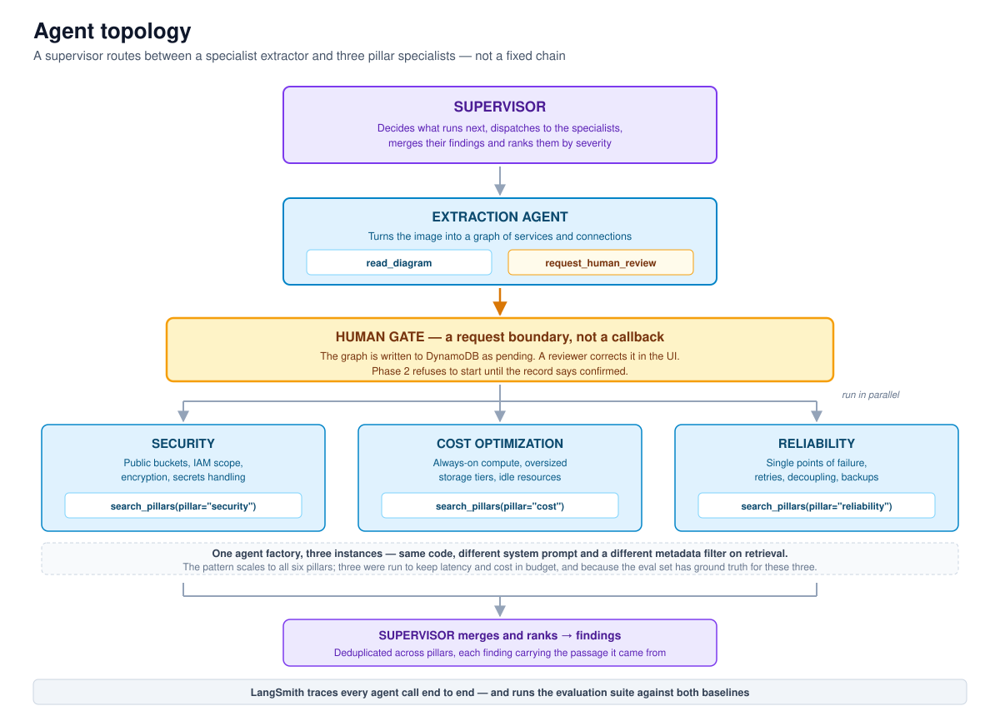

# Well-Architected Review Agent


A multimodal AI pipeline that reads an **AWS architecture diagram as an image** and reviews it against the AWS Well-Architected Framework — with a human confirmation gate at the point where the model is measurably unreliable.

> Ironhack Final Project (GenAI). Individual work.

---

## The problem this solves

Reviewing an architecture against the Well-Architected Framework is slow, and the diagram is usually the only artefact that exists. There is no manifest, no Terraform state — just a picture in a slide deck.

A vision model can read that picture. But it cannot read it *reliably*, and it does not know that about itself.

## The finding that shaped the design

Before building anything, one spike: Amazon Nova Lite, one real architecture diagram (1924×1959 px), temperature 0, asked for services, connections and self-reported confidence.

| Aspect | Result |
|---|---|
| Reading box labels (OCR) | **Excellent** — all 21 boxes correct, including `drift-check (PSI / KS test)` |
| Extracting connections | **Hallucinated** — chained the boxes linearly, producing edges absent from the image |
| Self-reported confidence | **Unusable** — 0.95 across the board, zero unreadable regions flagged |
| Latency / tokens | 7.4 s · 2,683 in / 1,057 out |

The model is reliable at reading *text* and unreliable at reading *structure* — while reporting high confidence in both. A pipeline that trusts the extracted graph would generate findings about an architecture that does not exist.

**So the human sits at the extraction step, not at the end as an approval rubber stamp.** The reviewer corrects the graph; only then does the review run.

See `experiments/vision_probe.py` for the spike.

---

## Architecture



```
PHASE 1 — EXTRACT (AI)          HUMAN GATE          PHASE 2 — REVIEW (AI)

  Upload  →  Extraction Agent → Human confirms  → Pillar Agents ×3 →  Findings
    │              │                  │                  │               │
 S3 + CDN      Bedrock          DynamoDB + SQS      Chroma index     Lambda +
              (Nova Lite)                              in S3        CloudWatch
```

### Agent topology



| Agent | Role | Tools |
|---|---|---|
| **Supervisor** | Routes between specialists, merges and ranks findings | — |
| **Extraction Agent** | Image → graph of services and connections | `read_diagram`, `request_human_review` |
| **Pillar Agents ×3** | Security, Cost Optimization, Reliability — in parallel | `search_pillars(pillar=…)` |

The three pillar agents are **one factory instantiated three times**: same code, different system prompt, different metadata filter on retrieval. The pattern scales to all six pillars; three are run to keep latency and cost in budget.

### The gate is a request boundary, not framework state

```
POST /extract  →  graph written to DynamoDB as status: pending
                  [ reviewer corrects it in the UI → status: confirmed ]
POST /review   →  refuses to run unless the record is confirmed
```

LangGraph offers built-in interrupts for human-in-the-loop, but those need a persistent checkpointer — fragile on stateless Lambda. Explicit state in DynamoDB is visible and debuggable when something goes wrong.

---

## Design decisions and trade-offs

| Decision | Choice | Reasoning |
|---|---|---|
| Model provider | Amazon Nova Lite on Bedrock | Anthropic models are blocked in the shared course account (Bedrock requires a use-case form I will not submit on an account I do not own). Nova is multimodal, available, cheaper. |
| Model invocation | Bedrock via IAM role | No API key stored anywhere; the whole pipeline stays inside AWS. |
| Model id | `us.amazon.nova-lite-v1:0` | The `us.` inference-profile prefix is mandatory — the bare model id is rejected with `ValidationException`. |
| Vector store | Chroma, index persisted in S3 | The corpus is small and static. OpenSearch Serverless has a high monthly floor that a handful of whitepapers cannot justify. |
| Compute | Lambda container image, arm64, Function URL | Demo traffic fits the free tier; nothing runs at idle. The price is cold start, addressed in the performance section. |
| Frontend | Static HTML/JS on S3 + CloudFront | Near-zero cost, clean frontend/backend separation. |
| Upload path | Presigned S3 URLs | No public bucket; the browser never holds credentials. |
| HITL state | DynamoDB, two endpoints | Lambda is stateless; explicit state is inspectable. |

---

## Repository structure

```
backend/
  agents/        supervisor, extraction agent, pillar agent factory
  tools/         read_diagram, search_pillars, request_human_review
  api/           FastAPI routes (/extract, /review)
  core/          config, AWS clients, shared models
frontend/        upload UI and human review UI
deployment/
  infra/manual/  AWS CLI scripts, one per service
evaluation/
  datasets/      ground-truth diagrams and expected findings
experiments/     spikes, including work that did not reach production
tests/           pytest + moto
docs/
  diagrams/      architecture and agent topology
```

---

## Setup

```bash
python3 -m venv .venv
source .venv/bin/activate
pip install -r requirements-dev.txt
cp .env.example .env    # then fill in
```

Requires AWS credentials with Bedrock access in `us-east-1`.

*Deployment instructions: see `deployment/README.md` (added on day 6).*

---

## Evaluation

Two baselines, both measured in LangSmith:

- **Baseline 1** — naive single pass, no gate. Isolates what the human gate is worth.
- **Baseline 2** — one generalist agent instead of three pillar specialists. Isolates what the multi-agent split is worth.

Metrics: graph extraction accuracy, hallucinated-edge rate, context relevancy, citation groundedness, latency, cost per request.

*Results: added on day 8.*

---

## Status

| Day | Milestone | State |
|---|---|---|
| 1 | Vision spike, repository structure | done |
| 2 | Corpus ingestion, Chroma index with pillar metadata | |
| 3 | Extraction agent | |
| 4 | Supervisor and pillar agents | |
| 5 | Human-in-the-loop path | |
| 6 | Deployment: ECR, Lambda, IAM | |
| 7 | CloudFront, frontend, review UI | |
| 8 | Evaluation | |
| 9 | Tests and observability | |
| 10 | Documentation and slides | |

---

## Credits and sources

- **AWS Well-Architected Framework** whitepapers — published by AWS, used as the retrieval corpus
- **Amazon Bedrock** (Nova Lite) for vision and reasoning
- **LangChain / LangGraph / LangSmith** for agent orchestration and evaluation
- **Chroma** as the vector store
- **Tooling** — AWS CLI, Claude Code

## License

MIT — see [LICENSE](LICENSE).
